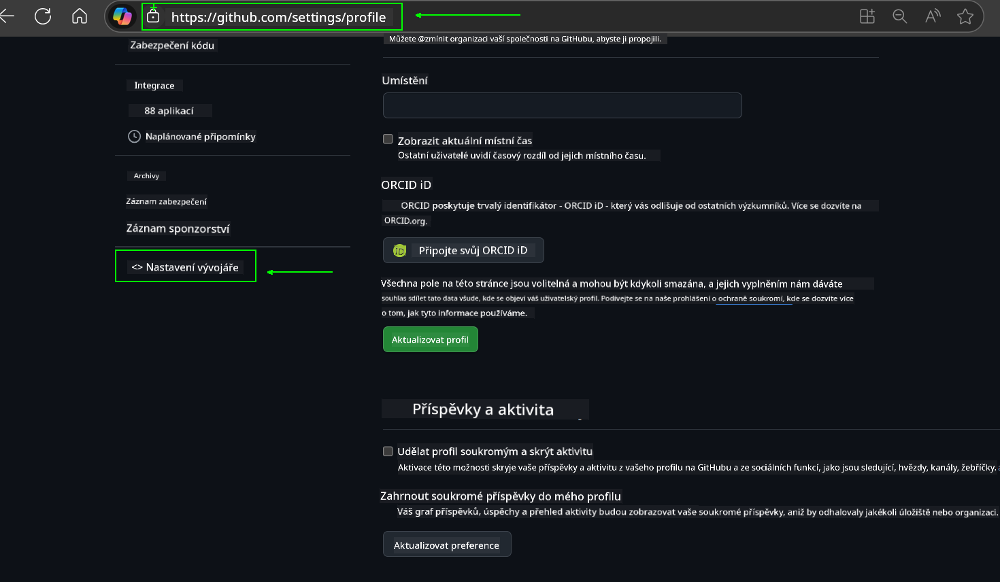
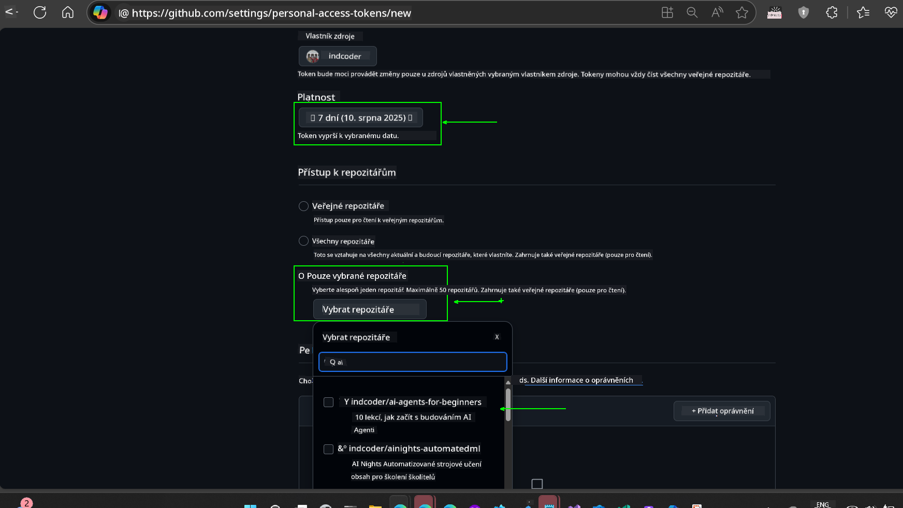

<!--
CO_OP_TRANSLATOR_METADATA:
{
  "original_hash": "8693a24942b670e3cb8def77f92513f9",
  "translation_date": "2025-08-21T13:47:17+00:00",
  "source_file": "00-course-setup/README.md",
  "language_code": "cs"
}
-->
# Nastavení kurzu

## Úvod

Tato lekce se zaměřuje na to, jak spustit ukázky kódu z tohoto kurzu.

## Klonování nebo forkování tohoto repozitáře

Nejprve si prosím naklonujte nebo forkněte GitHub repozitář. Tím získáte vlastní verzi materiálů kurzu, abyste mohli kód spouštět, testovat a upravovat!

To lze provést kliknutím na odkaz na

Měli byste nyní mít vlastní forknutou verzi tohoto kurzu na následujícím odkazu:


## Spuštění kódu

Tento kurz nabízí sérii Jupyter Notebooků, které si můžete spustit, abyste získali praktické zkušenosti s vytvářením AI agentů.

Ukázky kódu využívají buď:

**Vyžaduje GitHub účet - zdarma**:

1) Semantic Kernel Agent Framework + GitHub Models Marketplace. Označeno jako (semantic-kernel.ipynb)  
2) AutoGen Framework + GitHub Models Marketplace. Označeno jako (autogen.ipynb)  

**Vyžaduje předplatné Azure**:  
3) Azure AI Foundry + Azure AI Agent Service. Označeno jako (azureaiagent.ipynb)  

Doporučujeme vyzkoušet všechny tři typy příkladů, abyste zjistili, který vám nejlépe vyhovuje.

Podle toho, kterou možnost si vyberete, budete muset postupovat podle příslušných kroků nastavení uvedených níže:

## Požadavky

- Python 3.12+  
  - **POZNÁMKA**: Pokud nemáte nainstalovaný Python 3.12, ujistěte se, že jej nainstalujete. Poté vytvořte svůj virtuální prostředí (venv) pomocí python3.12, aby byly správné verze nainstalovány ze souboru requirements.txt.
- GitHub účet - pro přístup k GitHub Models Marketplace
- Předplatné Azure - pro přístup k Azure AI Foundry
- Účet Azure AI Foundry - pro přístup k Azure AI Agent Service

V kořenovém adresáři tohoto repozitáře jsme zahrnuli soubor `requirements.txt`, který obsahuje všechny potřebné Python balíčky pro spuštění ukázek kódu.

Můžete je nainstalovat spuštěním následujícího příkazu v terminálu v kořenovém adresáři repozitáře:

```bash
pip install -r requirements.txt
```  
Doporučujeme vytvořit Python virtuální prostředí, abyste předešli konfliktům a problémům.

## Nastavení VSCode
Ujistěte se, že ve VSCode používáte správnou verzi Pythonu.


## Nastavení pro ukázky využívající GitHub Models 

### Krok 1: Získání vašeho GitHub Personal Access Token (PAT)

Tento kurz využívá GitHub Models Marketplace, který poskytuje bezplatný přístup k velkým jazykovým modelům (LLMs), které budete používat k vytváření AI agentů.

Pro použití GitHub Models budete muset vytvořit [GitHub Personal Access Token](https://docs.github.com/en/authentication/keeping-your-account-and-data-secure/managing-your-personal-access-tokens).

To lze provést přechodem na váš

GitHub účet.

Postupujte podle [Principu nejmenších oprávnění](https://docs.github.com/en/get-started/learning-to-code/storing-your-secrets-safely) při vytváření tokenu. To znamená, že byste měli tokenu přidělit pouze ta oprávnění, která jsou nezbytná pro spuštění ukázek kódu v tomto kurzu.

1. Na levé straně obrazovky vyberte možnost `Fine-grained tokens` v sekci **Developer settings**.  
   

   Poté vyberte `Generate new token`.

   

2. Zadejte popisný název pro váš token, který odráží jeho účel, aby byl později snadno identifikovatelný.

    🔐 Doporučení pro dobu platnosti tokenu

    Doporučená doba platnosti: 30 dní  
    Pro větší bezpečnost můžete zvolit kratší období, například 7 dní 🛡️  
    Je to skvělý způsob, jak si stanovit osobní cíl a dokončit kurz, zatímco máte vysokou motivaci k učení 🚀.

    

3. Omezte rozsah tokenu na váš fork tohoto repozitáře.

    

4. Omezte oprávnění tokenu: V sekci **Permissions** klikněte na záložku **Account** a poté na tlačítko "+ Add permissions". Zobrazí se rozbalovací nabídka. Vyhledejte **Models** a zaškrtněte příslušné políčko.  
    

5. Ověřte požadovaná oprávnění před vygenerováním tokenu.  
    

6. Před vygenerováním tokenu se ujistěte, že jste připraveni token uložit na bezpečné místo, například do trezoru správce hesel, protože po vytvoření již nebude zobrazen.  
    

Zkopírujte svůj nový token, který jste právě vytvořili. Nyní jej přidáte do souboru `.env` zahrnutého v tomto kurzu.

### Krok 2: Vytvoření souboru `.env`

Pro vytvoření souboru `.env` spusťte následující příkaz v terminálu.

```bash
cp .env.example .env
```

Tím zkopírujete příkladový soubor a vytvoříte `.env` ve vašem adresáři, kde vyplníte hodnoty pro proměnné prostředí.

Se zkopírovaným tokenem otevřete soubor `.env` ve svém oblíbeném textovém editoru a vložte svůj token do pole `GITHUB_TOKEN`.  


Nyní byste měli být schopni spustit ukázky kódu z tohoto kurzu.

## Nastavení pro ukázky využívající Azure AI Foundry a Azure AI Agent Service

### Krok 1: Získání koncového bodu vašeho projektu Azure

Postupujte podle kroků pro vytvoření hubu a projektu v Azure AI Foundry, které naleznete zde: [Přehled zdrojů hubu](https://learn.microsoft.com/en-us/azure/ai-foundry/concepts/ai-resources)

Jakmile vytvoříte svůj projekt, budete muset získat připojovací řetězec pro váš projekt.

To lze provést přechodem na stránku **Přehled** vašeho projektu v portálu Azure AI Foundry.


### Krok 2: Vytvoření souboru `.env`

Pro vytvoření souboru `.env` spusťte následující příkaz v terminálu.

```bash
cp .env.example .env
```

Tím zkopírujete příkladový soubor a vytvoříte `.env` ve vašem adresáři, kde vyplníte hodnoty pro proměnné prostředí.

Se zkopírovaným tokenem otevřete soubor `.env` ve svém oblíbeném textovém editoru a vložte svůj token do pole `PROJECT_ENDPOINT`.

### Krok 3: Přihlášení do Azure

Jako bezpečnostní nejlepší praxi použijeme [autentizaci bez klíče](https://learn.microsoft.com/azure/developer/ai/keyless-connections?tabs=csharp%2Cazure-cli?WT.mc_id=academic-105485-koreyst) pro přihlášení do Azure OpenAI pomocí Microsoft Entra ID.

Otevřete terminál a spusťte `az login --use-device-code`, abyste se přihlásili ke svému Azure účtu.

Po přihlášení vyberte své předplatné v terminálu.

## Další proměnné prostředí - Azure Search a Azure OpenAI 

Pro lekci Agentic RAG - Lekce 5 - jsou zde ukázky, které využívají Azure Search a Azure OpenAI.

Pokud chcete tyto ukázky spustit, budete muset přidat následující proměnné prostředí do svého souboru `.env`:

### Stránka Přehled (Projekt)

- `AZURE_SUBSCRIPTION_ID` - Zkontrolujte **Podrobnosti projektu** na stránce **Přehled** vašeho projektu.

- `AZURE_AI_PROJECT_NAME` - Podívejte se na horní část stránky **Přehled** vašeho projektu.

- `AZURE_OPENAI_SERVICE` - Najděte to na záložce **Zahrnuté schopnosti** pro **Azure OpenAI Service** na stránce **Přehled**.

### Centrum správy

- `AZURE_OPENAI_RESOURCE_GROUP` - Přejděte na **Vlastnosti projektu** na stránce **Přehled** v **Centru správy**.

- `GLOBAL_LLM_SERVICE` - V sekci **Připojené zdroje** najděte název připojení **Azure AI Services**. Pokud není uveden, zkontrolujte **Azure portal** ve své skupině zdrojů pro název zdroje AI Services.

### Stránka Modely + Koncové body

- `AZURE_OPENAI_EMBEDDING_DEPLOYMENT_NAME` - Vyberte svůj embedding model (např. `text-embedding-ada-002`) a poznamenejte si **Název nasazení** z podrobností modelu.

- `AZURE_OPENAI_CHAT_DEPLOYMENT_NAME` - Vyberte svůj chat model (např. `gpt-4o-mini`) a poznamenejte si **Název nasazení** z podrobností modelu.

### Azure Portal

- `AZURE_OPENAI_ENDPOINT` - Vyhledejte **Azure AI services**, klikněte na něj, poté přejděte na **Správa zdrojů**, **Klíče a koncové body**, sjeďte dolů na "Azure OpenAI endpoints" a zkopírujte ten, který říká "Language APIs".

- `AZURE_OPENAI_API_KEY` - Na stejné obrazovce zkopírujte KLÍČ 1 nebo KLÍČ 2.

- `AZURE_SEARCH_SERVICE_ENDPOINT` - Najděte svůj zdroj **Azure AI Search**, klikněte na něj a podívejte se na **Přehled**.

- `AZURE_SEARCH_API_KEY` - Poté přejděte na **Nastavení** a poté **Klíče**, abyste zkopírovali primární nebo sekundární administrátorský klíč.

### Externí webová stránka

- `AZURE_OPENAI_API_VERSION` - Navštivte stránku [Životní cyklus verzí API](https://learn.microsoft.com/en-us/azure/ai-services/openai/api-version-deprecation#latest-ga-api-release) pod **Nejnovější GA vydání API**.

### Nastavení autentizace bez klíče

Místo pevného zakódování vašich přihlašovacích údajů použijeme připojení bez klíče s Azure OpenAI. K tomu importujeme `DefaultAzureCredential` a později zavoláme funkci `DefaultAzureCredential`, abychom získali přihlašovací údaje.

```python
from azure.identity import DefaultAzureCredential, InteractiveBrowserCredential
```

## Zasekli jste se?

Pokud máte jakékoli problémy s tímto nastavením, připojte se do naší

## Další lekce

Nyní jste připraveni spustit kód pro tento kurz. Přejeme vám hodně zábavy při objevování světa AI agentů!

[Úvod do AI agentů a jejich využití](../01-intro-to-ai-agents/README.md)

**Prohlášení:**  
Tento dokument byl přeložen pomocí služby pro automatizovaný překlad [Co-op Translator](https://github.com/Azure/co-op-translator). Ačkoli se snažíme o přesnost, mějte prosím na paměti, že automatizované překlady mohou obsahovat chyby nebo nepřesnosti. Původní dokument v jeho původním jazyce by měl být považován za autoritativní zdroj. Pro důležité informace se doporučuje profesionální lidský překlad. Neodpovídáme za žádná nedorozumění nebo nesprávné interpretace vyplývající z použití tohoto překladu.