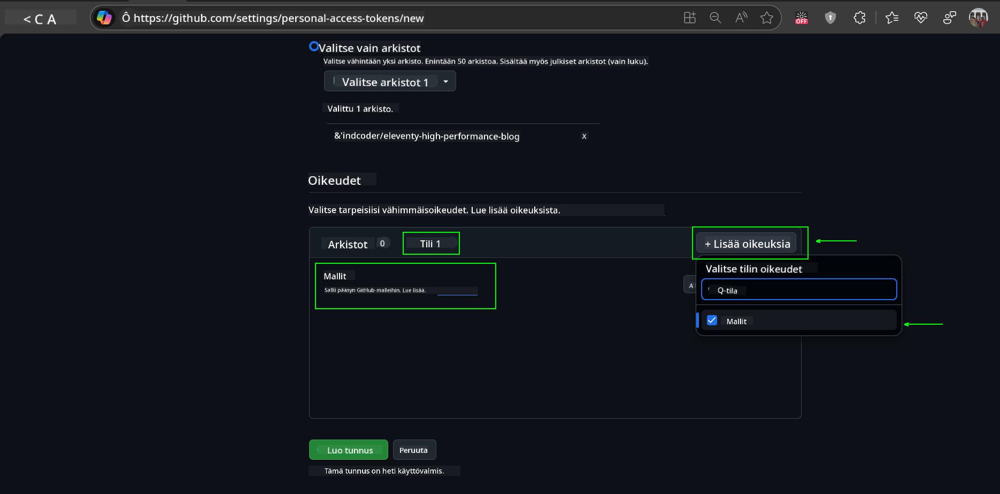
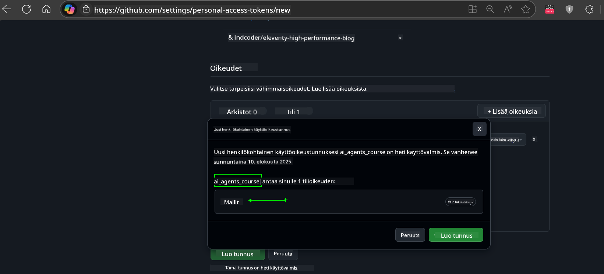
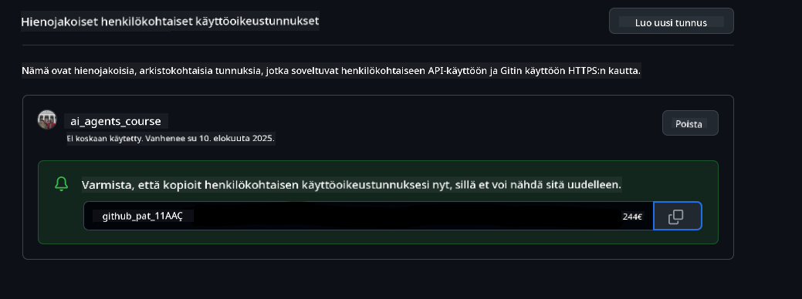
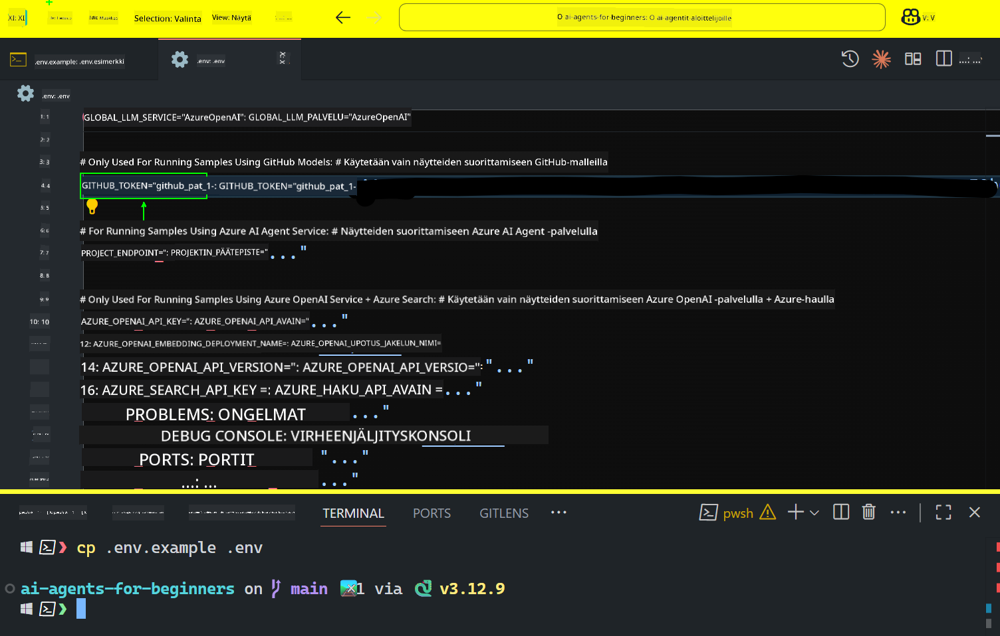

<!--
CO_OP_TRANSLATOR_METADATA:
{
  "original_hash": "8693a24942b670e3cb8def77f92513f9",
  "translation_date": "2025-08-21T13:21:42+00:00",
  "source_file": "00-course-setup/README.md",
  "language_code": "fi"
}
-->
# Kurssin Aloitus

## Johdanto

Tässä osiossa käymme läpi, miten voit suorittaa tämän kurssin koodiesimerkit.

## Kloonaa tai haarauta tämä repositorio

Aloita kloonaamalla tai haaroittamalla GitHub-repositorio. Näin saat oman version kurssimateriaalista, jota voit suorittaa, testata ja muokata!

Tämä onnistuu klikkaamalla linkkiä

Sinulla pitäisi nyt olla oma haarautettu versio tästä kurssista seuraavassa linkissä:


## Koodin suorittaminen

Tämä kurssi tarjoaa sarjan Jupyter Notebookeja, joiden avulla pääset käytännössä kokeilemaan tekoälyagenttien rakentamista.

Koodiesimerkit käyttävät joko:

**Vaatii GitHub-tilin - Ilmainen**:

1) Semantic Kernel Agent Framework + GitHub Models Marketplace. Merkitty nimellä (semantic-kernel.ipynb)
2) AutoGen Framework + GitHub Models Marketplace. Merkitty nimellä (autogen.ipynb)

**Vaatii Azure-tilauksen**:
3) Azure AI Foundry + Azure AI Agent Service. Merkitty nimellä (azureaiagent.ipynb)

Suosittelemme kokeilemaan kaikkia kolmea esimerkkiä nähdäksesi, mikä niistä sopii sinulle parhaiten.

Valitsemasi vaihtoehto määrittää, mitkä asennusvaiheet sinun tulee suorittaa alla:

## Vaatimukset

- Python 3.12+
  - **HUOM**: Jos sinulla ei ole Python 3.12:ta asennettuna, varmista, että asennat sen. Luo sitten virtuaaliympäristösi käyttämällä python3.12 varmistaaksesi, että requirements.txt-tiedostosta asennetaan oikeat versiot.
- GitHub-tili - Pääsy GitHub Models Marketplaceen
- Azure-tilaus - Pääsy Azure AI Foundryyn
- Azure AI Foundry -tili - Pääsy Azure AI Agent Serviceen

Repositorion juuresta löytyy `requirements.txt`-tiedosto, joka sisältää kaikki tarvittavat Python-paketit koodiesimerkkien suorittamiseen.

Voit asentaa ne suorittamalla seuraavan komennon terminaalissasi repositorion juuressa:

```bash
pip install -r requirements.txt
```
Suosittelemme luomaan Python-virtuaaliympäristön välttääksesi mahdolliset ristiriidat ja ongelmat.

## VSCode-asennus
Varmista, että käytät oikeaa Python-versiota VSCode:ssa.


## GitHub Models -esimerkkien asennus

### Vaihe 1: Hanki GitHubin henkilökohtainen käyttöoikeustunnus (PAT)

Tämä kurssi hyödyntää GitHub Models Marketplacea, joka tarjoaa ilmaisen pääsyn suuriin kielimalleihin (LLM), joita käytät tekoälyagenttien rakentamiseen.

GitHub-mallien käyttämiseksi sinun tulee luoda [GitHubin henkilökohtainen käyttöoikeustunnus](https://docs.github.com/en/authentication/keeping-your-account-and-data-secure/managing-your-personal-access-tokens).

Tämä onnistuu siirtymällä GitHub-tilillesi.

Noudata [vähimmän oikeuden periaatetta](https://docs.github.com/en/get-started/learning-to-code/storing-your-secrets-safely) luodessasi tunnusta. Tämä tarkoittaa, että sinun tulisi antaa tunnukselle vain ne oikeudet, joita tarvitaan tämän kurssin koodiesimerkkien suorittamiseen.

1. Valitse `Fine-grained tokens` -vaihtoehto näytön vasemmasta reunasta siirtymällä **Kehittäjäasetuksiin**.
   

   Valitse sitten `Generate new token`.

   

2. Anna tunnukselle kuvaava nimi, joka heijastaa sen tarkoitusta, jotta se on helppo tunnistaa myöhemmin.

    🔐 Suositeltu tunnuksen voimassaoloaika

    Suositeltu voimassaoloaika: 30 päivää  
    Turvallisuuden lisäämiseksi voit valita lyhyemmän ajan, kuten 7 päivää 🛡️.  
    Tämä on hyvä tapa asettaa henkilökohtainen tavoite ja suorittaa kurssi oppimisen ollessa vauhdissa 🚀.

    

3. Rajoita tunnuksen käyttöoikeus haarautettuun repositorioosi.

    

4. Rajoita tunnuksen oikeudet: Valitse **Permissions**-kohdasta **Account**-välilehti ja napsauta "+ Add permissions" -painiketta. Avautuvasta valikosta etsi **Models** ja valitse se.
    

5. Varmista tarvittavat oikeudet ennen tunnuksen luomista. 

6. Ennen tunnuksen luomista varmista, että olet valmis tallentamaan tunnuksen turvalliseen paikkaan, kuten salasananhallintasovellukseen, sillä sitä ei näytetä uudelleen luomisen jälkeen. 

Kopioi juuri luomasi tunnus. Lisää se nyt tämän kurssin mukana toimitettuun `.env`-tiedostoon.

### Vaihe 2: Luo `.env`-tiedosto

Luo `.env`-tiedosto suorittamalla seuraava komento terminaalissasi.

```bash
cp .env.example .env
```

Tämä kopioi esimerkkitiedoston ja luo `.env`-tiedoston hakemistoosi, jossa täytät ympäristömuuttujien arvot.

Kopioidun tunnuksen kanssa avaa `.env`-tiedosto suosikkitekstieditorissasi ja liitä tunnus `GITHUB_TOKEN`-kenttään.  


Nyt sinun pitäisi pystyä suorittamaan tämän kurssin koodiesimerkit.

## Azure AI Foundry- ja Azure AI Agent Service -esimerkkien asennus

### Vaihe 1: Hanki Azure-projektin päätepiste

Noudata ohjeita hubin ja projektin luomiseksi Azure AI Foundryssa täältä: [Hub-resurssien yleiskatsaus](https://learn.microsoft.com/en-us/azure/ai-foundry/concepts/ai-resources)

Kun olet luonut projektisi, sinun tulee hankkia projektisi yhteysmerkkijono.

Tämä onnistuu siirtymällä projektisi **Yleiskatsaus**-sivulle Azure AI Foundry -portaalissa.


### Vaihe 2: Luo `.env`-tiedosto

Luo `.env`-tiedosto suorittamalla seuraava komento terminaalissasi.

```bash
cp .env.example .env
```

Tämä kopioi esimerkkitiedoston ja luo `.env`-tiedoston hakemistoosi, jossa täytät ympäristömuuttujien arvot.

Kopioidun tunnuksen kanssa avaa `.env`-tiedosto suosikkitekstieditorissasi ja liitä tunnus `PROJECT_ENDPOINT`-kenttään.

### Vaihe 3: Kirjaudu sisään Azureen

Turvallisuuskäytännön mukaisesti käytämme [avaimetonta todennusta](https://learn.microsoft.com/azure/developer/ai/keyless-connections?tabs=csharp%2Cazure-cli?WT.mc_id=academic-105485-koreyst) todennukseen Azure OpenAI:hin Microsoft Entra ID:n avulla.

Avaa seuraavaksi terminaali ja suorita `az login --use-device-code` kirjautuaksesi sisään Azure-tilillesi.

Kun olet kirjautunut sisään, valitse tilauksesi terminaalissa.

## Lisäympäristömuuttujat - Azure Search ja Azure OpenAI

Agentic RAG -oppituntia (oppitunti 5) varten on esimerkkejä, jotka käyttävät Azure Searchia ja Azure OpenAI:ta.

Jos haluat suorittaa nämä esimerkit, sinun tulee lisätä seuraavat ympäristömuuttujat `.env`-tiedostoosi:

### Yleiskatsaus-sivu (Projekti)

- `AZURE_SUBSCRIPTION_ID` - Tarkista **Projektin tiedot** projektisi **Yleiskatsaus**-sivulta.

- `AZURE_AI_PROJECT_NAME` - Katso projektisi **Yleiskatsaus**-sivun yläosasta.

- `AZURE_OPENAI_SERVICE` - Löydät tämän **Sisältyvät ominaisuudet** -välilehdeltä **Azure OpenAI Service** -kohdasta projektisi **Yleiskatsaus**-sivulla.

### Hallintakeskus

- `AZURE_OPENAI_RESOURCE_GROUP` - Siirry **Projektin ominaisuudet** -kohtaan projektisi **Yleiskatsaus**-sivulla **Hallintakeskuksessa**.

- `GLOBAL_LLM_SERVICE` - **Liitetyt resurssit** -kohdasta löydät **Azure AI Services** -yhteyden nimen. Jos sitä ei ole listattu, tarkista **Azure-portaalista** resurssiryhmäsi AI Services -resurssin nimi.

### Mallit + päätepisteet -sivu

- `AZURE_OPENAI_EMBEDDING_DEPLOYMENT_NAME` - Valitse upotusmallisi (esim. `text-embedding-ada-002`) ja merkitse muistiin **Deployment name** mallin tiedoista.

- `AZURE_OPENAI_CHAT_DEPLOYMENT_NAME` - Valitse keskustelumallisi (esim. `gpt-4o-mini`) ja merkitse muistiin **Deployment name** mallin tiedoista.

### Azure-portaali

- `AZURE_OPENAI_ENDPOINT` - Etsi **Azure AI Services**, klikkaa sitä, siirry **Resurssien hallinta**, **Avaimet ja päätepiste**, selaa alas kohtaan "Azure OpenAI endpoints" ja kopioi "Language APIs" -päätepiste.

- `AZURE_OPENAI_API_KEY` - Kopioi samalta sivulta AVAIN 1 tai AVAIN 2.

- `AZURE_SEARCH_SERVICE_ENDPOINT` - Etsi **Azure AI Search** -resurssisi, klikkaa sitä ja katso **Yleiskatsaus**.

- `AZURE_SEARCH_API_KEY` - Siirry sitten **Asetukset** ja sitten **Avaimet** kopioidaksesi ensisijaisen tai toissijaisen hallinta-avaimen.

### Ulkoinen verkkosivu

- `AZURE_OPENAI_API_VERSION` - Vieraile [API-version elinkaari](https://learn.microsoft.com/en-us/azure/ai-services/openai/api-version-deprecation#latest-ga-api-release) -sivulla kohdassa **Latest GA API release**.

### Avaimeton todennus

Sen sijaan, että kovakoodaisimme tunnistetietosi, käytämme avaimetonta yhteyttä Azure OpenAI:hin. Tätä varten tuomme `DefaultAzureCredential`-luokan ja kutsumme myöhemmin `DefaultAzureCredential`-funktiota saadaksemme tunnisteen.

```python
from azure.identity import DefaultAzureCredential, InteractiveBrowserCredential
```

## Jäikö jokin kohta epäselväksi?

Jos kohtaat ongelmia tämän asennuksen aikana, liity keskusteluumme

## Seuraava oppitunti

Olet nyt valmis suorittamaan tämän kurssin koodiesimerkit. Onnea matkaan tekoälyagenttien maailmaan!

[Johdanto tekoälyagentteihin ja niiden käyttötapauksiin](../01-intro-to-ai-agents/README.md)

**Vastuuvapauslauseke**:  
Tämä asiakirja on käännetty käyttämällä tekoälypohjaista käännöspalvelua [Co-op Translator](https://github.com/Azure/co-op-translator). Pyrimme tarkkuuteen, mutta huomioithan, että automaattiset käännökset voivat sisältää virheitä tai epätarkkuuksia. Alkuperäistä asiakirjaa sen alkuperäisellä kielellä tulee pitää ensisijaisena lähteenä. Kriittisen tiedon osalta suositellaan ammattimaista ihmiskääntämistä. Emme ole vastuussa tämän käännöksen käytöstä aiheutuvista väärinkäsityksistä tai virhetulkinnoista.