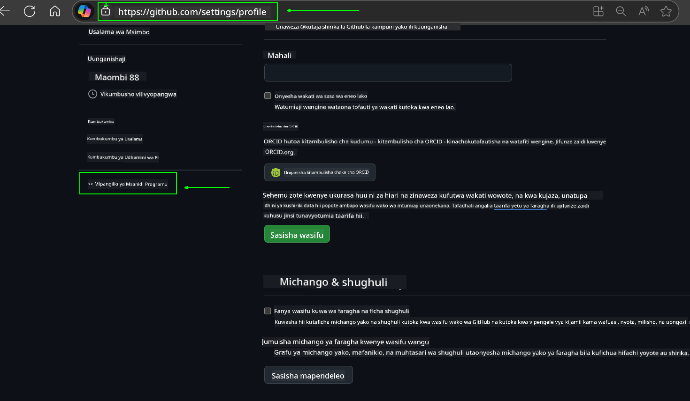
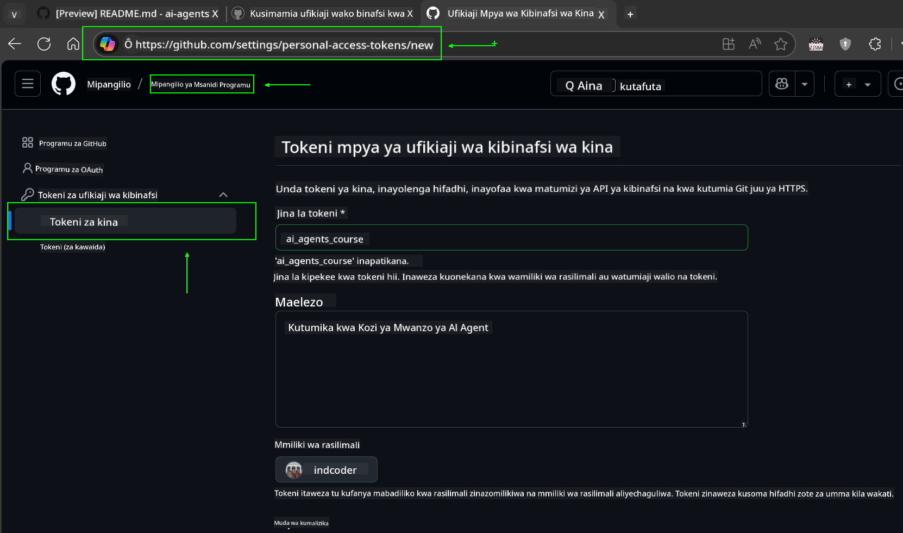
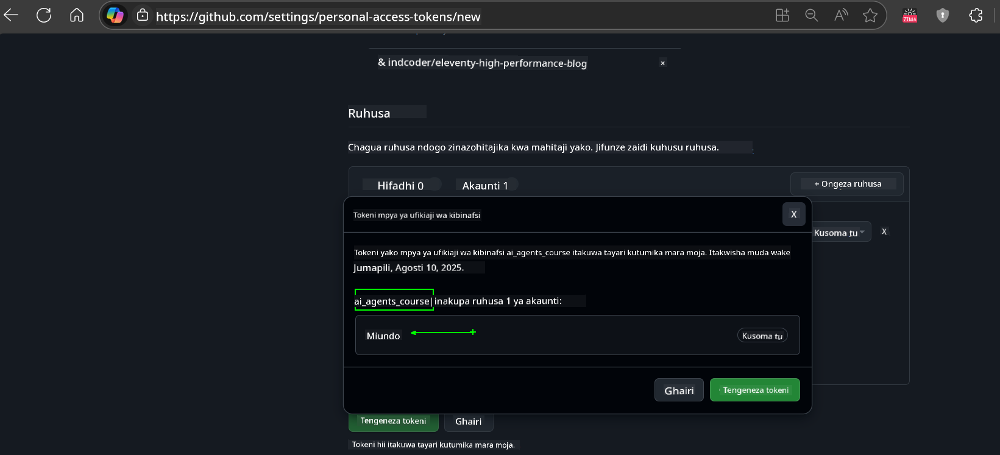

<!--
CO_OP_TRANSLATOR_METADATA:
{
  "original_hash": "8693a24942b670e3cb8def77f92513f9",
  "translation_date": "2025-08-21T13:39:53+00:00",
  "source_file": "00-course-setup/README.md",
  "language_code": "sw"
}
-->
# Maandalizi ya Kozi

## Utangulizi

Somo hili litafundisha jinsi ya kuendesha mifano ya msimbo wa kozi hii.

## Nakili au Fork Hifadhi Hii

Ili kuanza, tafadhali nakili au fork Hifadhi ya GitHub. Hii itakupa toleo lako binafsi la nyenzo za kozi ili uweze kuendesha, kujaribu, na kurekebisha msimbo!

Hii inaweza kufanyika kwa kubofya kiungo hadi

Unafaa sasa kuwa na toleo lako la fork la kozi hii katika kiungo kifuatacho:


## Kuendesha Msimbo

Kozi hii inatoa mfululizo wa Jupyter Notebooks ambazo unaweza kuendesha ili kupata uzoefu wa vitendo wa kujenga Mawakala wa AI.

Mifano ya msimbo hutumia:

**Inahitaji Akaunti ya GitHub - Bila Malipo**:

1) Mfumo wa Semantic Kernel Agent + Soko la Miundo la GitHub. Imewekwa alama kama (semantic-kernel.ipynb)  
2) Mfumo wa AutoGen + Soko la Miundo la GitHub. Imewekwa alama kama (autogen.ipynb)

**Inahitaji Usajili wa Azure**:  
3) Azure AI Foundry + Huduma ya Wakala wa Azure AI. Imewekwa alama kama (azureaiagent.ipynb)

Tunakuhimiza ujaribu mifano yote mitatu ili kuona ni ipi inakufaa zaidi.

Chaguo lolote utakaloamua, litaamua hatua za maandalizi unazohitaji kufuata hapa chini:

## Mahitaji

- Python 3.12+  
  - **NOTE**: Ikiwa huna Python3.12 imewekwa, hakikisha unaweka. Kisha unda mazingira yako ya kawaida (venv) ukitumia python3.12 ili kuhakikisha matoleo sahihi yamewekwa kutoka kwenye faili ya requirements.txt.  
- Akaunti ya GitHub - Kwa Ufikiaji wa Soko la Miundo la GitHub  
- Usajili wa Azure - Kwa Ufikiaji wa Azure AI Foundry  
- Akaunti ya Azure AI Foundry - Kwa Ufikiaji wa Huduma ya Wakala wa Azure AI  

Tumejumuisha faili ya `requirements.txt` kwenye mzizi wa hifadhi hii ambayo ina vifurushi vyote vya Python vinavyohitajika kuendesha mifano ya msimbo.

Unaweza kuviweka kwa kuendesha amri ifuatayo kwenye terminal yako ukiwa kwenye mzizi wa hifadhi:

```bash
pip install -r requirements.txt
```  
Tunapendekeza kuunda mazingira ya kawaida ya Python ili kuepuka migongano na matatizo yoyote.

## Kuweka VSCode  
Hakikisha unatumia toleo sahihi la Python katika VSCode.


## Maandalizi kwa Mifano Inayotumia Miundo ya GitHub  

### Hatua ya 1: Pata Tokeni Yako ya Ufikiaji Binafsi ya GitHub (PAT)  

Kozi hii inatumia Soko la Miundo la GitHub, linalotoa ufikiaji wa bure kwa Miundo Mikubwa ya Lugha (LLMs) ambayo utatumia kujenga Mawakala wa AI.

Ili kutumia Miundo ya GitHub, utahitaji kuunda [Tokeni ya Ufikiaji Binafsi ya GitHub](https://docs.github.com/en/authentication/keeping-your-account-and-data-secure/managing-your-personal-access-tokens).

Hii inaweza kufanyika kwa kwenda kwenye akaunti yako ya GitHub.

Tafadhali fuata [Kanuni ya Upendeleo wa Chini](https://docs.github.com/en/get-started/learning-to-code/storing-your-secrets-safely) unapounda tokeni yako. Hii inamaanisha unapaswa kutoa tokeni ruhusa tu zinazohitajika kuendesha mifano ya msimbo katika kozi hii.

1. Chagua chaguo la `Fine-grained tokens` upande wa kushoto wa skrini yako kwa kupitia **Developer settings**  
   

   Kisha chagua `Generate new token`.

   

2. Weka jina la maelezo kwa tokeni yako linaloonyesha madhumuni yake, ili iwe rahisi kuitambua baadaye.

    🔐 Pendekezo la Muda wa Tokeni  

    Muda uliopendekezwa: Siku 30  
    Kwa usalama zaidi, unaweza kuchagua kipindi kifupi—kama siku 7 🛡️  
    Ni njia nzuri ya kuweka lengo binafsi na kukamilisha kozi huku ukiwa na kasi ya kujifunza 🚀.

    

3. Punguza wigo wa tokeni kwa fork yako ya hifadhi hii.

    

4. Punguza ruhusa za tokeni: Chini ya **Permissions**, bofya kichupo cha **Account**, na bofya kitufe cha "+ Add permissions". Kutakuwa na menyu kunjuzi. Tafadhali tafuta **Models** na weka alama kwenye kisanduku chake.  
    

5. Hakikisha ruhusa zinazohitajika kabla ya kuzalisha tokeni. 

6. Kabla ya kuzalisha tokeni, hakikisha uko tayari kuhifadhi tokeni hiyo mahali salama kama vile hifadhi ya msimbo wa siri, kwani haitatolewa tena baada ya kuunda. 

Nakili tokeni yako mpya uliyoitengeneza. Sasa utaiongeza kwenye faili yako ya `.env` iliyojumuishwa katika kozi hii.

### Hatua ya 2: Unda Faili Yako ya `.env`

Ili kuunda faili yako ya `.env` endesha amri ifuatayo kwenye terminal yako.

```bash
cp .env.example .env
```

Hii itanakili faili ya mfano na kuunda `.env` kwenye saraka yako ambapo utaweka maadili ya vigezo vya mazingira.

Ukiwa na tokeni yako umenakili, fungua faili ya `.env` katika mhariri wa maandishi unaoupenda na ubandike tokeni yako kwenye sehemu ya `GITHUB_TOKEN`.  


Sasa unapaswa kuwa na uwezo wa kuendesha mifano ya msimbo wa kozi hii.

## Maandalizi kwa Mifano Inayotumia Azure AI Foundry na Huduma ya Wakala wa Azure AI  

### Hatua ya 1: Pata Endpoint ya Mradi Wako wa Azure  

Fuata hatua za kuunda hub na mradi katika Azure AI Foundry zilizopatikana hapa: [Hub resources overview](https://learn.microsoft.com/en-us/azure/ai-foundry/concepts/ai-resources)

Baada ya kuunda mradi wako, utahitaji kupata kamba ya muunganisho wa mradi wako.

Hii inaweza kufanyika kwa kwenda kwenye ukurasa wa **Overview** wa mradi wako katika portal ya Azure AI Foundry.


### Hatua ya 2: Unda Faili Yako ya `.env`

Ili kuunda faili yako ya `.env` endesha amri ifuatayo kwenye terminal yako.

```bash
cp .env.example .env
```

Hii itanakili faili ya mfano na kuunda `.env` kwenye saraka yako ambapo utaweka maadili ya vigezo vya mazingira.

Ukiwa na tokeni yako umenakili, fungua faili ya `.env` katika mhariri wa maandishi unaoupenda na ubandike tokeni yako kwenye sehemu ya `PROJECT_ENDPOINT`.

### Hatua ya 3: Ingia kwenye Azure  

Kama utaratibu bora wa usalama, tutatumia [uthibitishaji bila funguo](https://learn.microsoft.com/azure/developer/ai/keyless-connections?tabs=csharp%2Cazure-cli?WT.mc_id=academic-105485-koreyst) kuingia kwenye Azure OpenAI kwa kutumia Microsoft Entra ID.

Ifuatayo, fungua terminal na endesha `az login --use-device-code` ili kuingia kwenye akaunti yako ya Azure.

Baada ya kuingia, chagua usajili wako kwenye terminal.

## Vigezo vya Ziada vya Mazingira - Azure Search na Azure OpenAI  

Kwa Somo la Agentic RAG - Somo la 5 - kuna mifano inayotumia Azure Search na Azure OpenAI.

Ikiwa unataka kuendesha mifano hii, utahitaji kuongeza vigezo vifuatavyo vya mazingira kwenye faili yako ya `.env`:

### Ukurasa wa Muhtasari (Mradi)

- `AZURE_SUBSCRIPTION_ID` - Angalia **Project details** kwenye ukurasa wa **Overview** wa mradi wako.  
- `AZURE_AI_PROJECT_NAME` - Angalia juu ya ukurasa wa **Overview** wa mradi wako.  
- `AZURE_OPENAI_SERVICE` - Pata hii kwenye kichupo cha **Included capabilities** kwa **Azure OpenAI Service** kwenye ukurasa wa **Overview**.  

### Kituo cha Usimamizi  

- `AZURE_OPENAI_RESOURCE_GROUP` - Nenda kwenye **Project properties** kwenye ukurasa wa **Overview** wa **Management Center**.  
- `GLOBAL_LLM_SERVICE` - Chini ya **Connected resources**, pata jina la muunganisho wa **Azure AI Services**. Ikiwa halijaorodheshwa, angalia **Azure portal** chini ya kikundi chako cha rasilimali kwa jina la rasilimali za AI Services.  

### Ukurasa wa Miundo + Endpoints  

- `AZURE_OPENAI_EMBEDDING_DEPLOYMENT_NAME` - Chagua mfano wako wa embedding (mfano, `text-embedding-ada-002`) na angalia **Deployment name** kutoka kwa maelezo ya mfano.  
- `AZURE_OPENAI_CHAT_DEPLOYMENT_NAME` - Chagua mfano wako wa mazungumzo (mfano, `gpt-4o-mini`) na angalia **Deployment name** kutoka kwa maelezo ya mfano.  

### Azure Portal  

- `AZURE_OPENAI_ENDPOINT` - Tafuta **Azure AI services**, bofya juu yake, kisha nenda kwenye **Resource Management**, **Keys and Endpoint**, teleza chini hadi "Azure OpenAI endpoints", na nakili ile inayoitwa "Language APIs".  
- `AZURE_OPENAI_API_KEY` - Kutoka skrini hiyo hiyo, nakili KEY 1 au KEY 2.  
- `AZURE_SEARCH_SERVICE_ENDPOINT` - Pata rasilimali yako ya **Azure AI Search**, bofya juu yake, na angalia **Overview**.  
- `AZURE_SEARCH_API_KEY` - Kisha nenda kwenye **Settings** na kisha **Keys** ili kunakili ufunguo wa msingi au wa pili wa msimamizi.  

### Ukurasa wa Nje  

- `AZURE_OPENAI_API_VERSION` - Tembelea ukurasa wa [API version lifecycle](https://learn.microsoft.com/en-us/azure/ai-services/openai/api-version-deprecation#latest-ga-api-release) chini ya **Latest GA API release**.  

### Kuweka uthibitishaji bila funguo  

Badala ya kuweka sifa zako moja kwa moja, tutatumia muunganisho bila funguo na Azure OpenAI. Ili kufanya hivyo, tutaingiza `DefaultAzureCredential` na baadaye kuita kazi ya `DefaultAzureCredential` ili kupata sifa.

```python
from azure.identity import DefaultAzureCredential, InteractiveBrowserCredential
```

## Umekwama Mahali Fulani?  

Ikiwa unakutana na matatizo yoyote ukiendesha maandalizi haya, jiunge na

## Somo Linalofuata  

Sasa uko tayari kuendesha msimbo wa kozi hii. Jifunze kwa furaha zaidi kuhusu ulimwengu wa Mawakala wa AI!  

[Utangulizi wa Mawakala wa AI na Matumizi Yake](../01-intro-to-ai-agents/README.md)  

**Kanusho**:  
Hati hii imetafsiriwa kwa kutumia huduma ya tafsiri ya AI [Co-op Translator](https://github.com/Azure/co-op-translator). Ingawa tunajitahidi kwa usahihi, tafadhali fahamu kuwa tafsiri za kiotomatiki zinaweza kuwa na makosa au kutokuwa sahihi. Hati ya asili katika lugha yake ya awali inapaswa kuzingatiwa kama chanzo cha mamlaka. Kwa taarifa muhimu, inashauriwa kutumia huduma ya tafsiri ya kitaalamu ya binadamu. Hatutawajibika kwa maelewano mabaya au tafsiri zisizo sahihi zinazotokana na matumizi ya tafsiri hii.