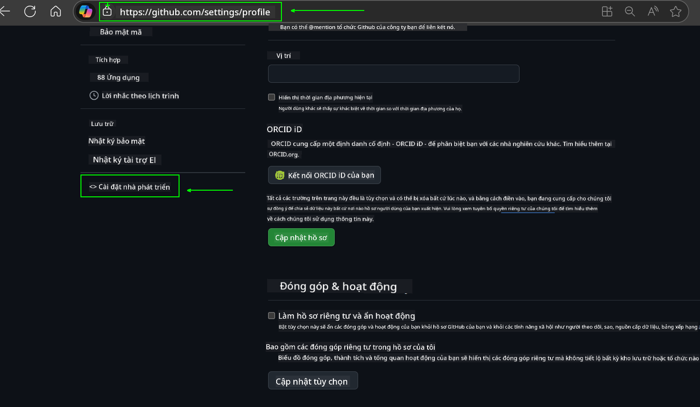
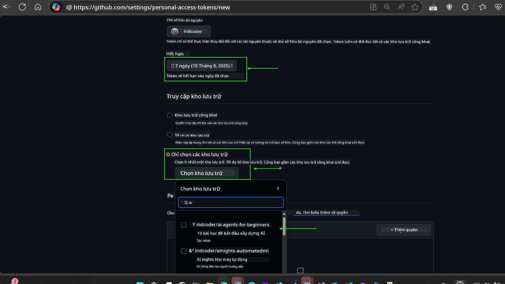
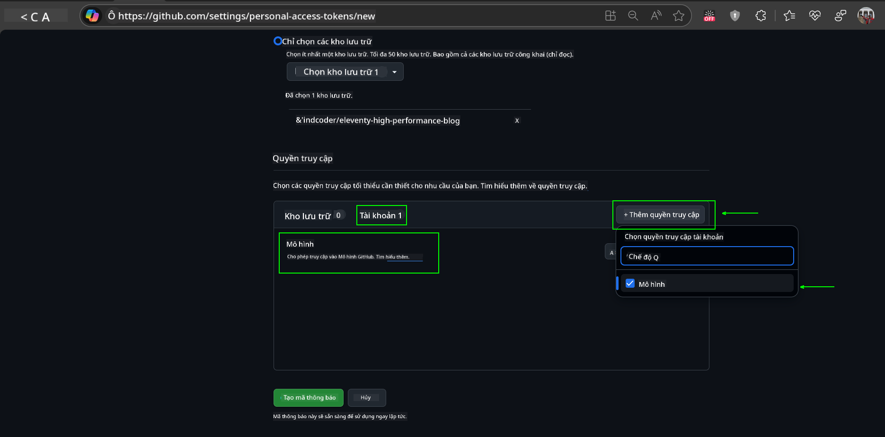

<!--
CO_OP_TRANSLATOR_METADATA:
{
  "original_hash": "8693a24942b670e3cb8def77f92513f9",
  "translation_date": "2025-08-21T13:29:44+00:00",
  "source_file": "00-course-setup/README.md",
  "language_code": "vi"
}
-->
# Cài Đặt Khóa Học

## Giới Thiệu

Bài học này sẽ hướng dẫn bạn cách chạy các mẫu mã của khóa học này.

## Sao Chép hoặc Fork Kho Lưu Trữ Này

Để bắt đầu, vui lòng sao chép hoặc fork kho lưu trữ GitHub. Điều này sẽ tạo ra phiên bản riêng của bạn về tài liệu khóa học để bạn có thể chạy, kiểm tra và điều chỉnh mã!

Điều này có thể được thực hiện bằng cách nhấp vào liên kết để

Bạn sẽ có phiên bản fork của khóa học này tại liên kết sau:


## Chạy Mã

Khóa học này cung cấp một loạt các Jupyter Notebooks mà bạn có thể chạy để trải nghiệm thực hành xây dựng các AI Agents.

Các mẫu mã sử dụng một trong các tùy chọn sau:

**Yêu cầu Tài Khoản GitHub - Miễn phí**:

1) Semantic Kernel Agent Framework + GitHub Models Marketplace. Được gắn nhãn là (semantic-kernel.ipynb)  
2) AutoGen Framework + GitHub Models Marketplace. Được gắn nhãn là (autogen.ipynb)  

**Yêu cầu Đăng Ký Azure**:  
3) Azure AI Foundry + Azure AI Agent Service. Được gắn nhãn là (azureaiagent.ipynb)  

Chúng tôi khuyến khích bạn thử cả ba loại ví dụ để xem loại nào phù hợp nhất với bạn.

Tùy chọn bạn chọn sẽ quyết định các bước thiết lập cần thực hiện bên dưới:

## Yêu Cầu

- Python 3.12+  
  - **LƯU Ý**: Nếu bạn chưa cài đặt Python 3.12, hãy đảm bảo cài đặt nó. Sau đó, tạo môi trường ảo (venv) bằng python3.12 để đảm bảo các phiên bản chính xác được cài đặt từ tệp requirements.txt.  
- Tài Khoản GitHub - Để truy cập GitHub Models Marketplace  
- Đăng Ký Azure - Để truy cập Azure AI Foundry  
- Tài Khoản Azure AI Foundry - Để truy cập Azure AI Agent Service  

Chúng tôi đã bao gồm một tệp `requirements.txt` trong thư mục gốc của kho lưu trữ này, chứa tất cả các gói Python cần thiết để chạy các mẫu mã.

Bạn có thể cài đặt chúng bằng cách chạy lệnh sau trong terminal tại thư mục gốc của kho lưu trữ:

```bash
pip install -r requirements.txt
```

Chúng tôi khuyến nghị tạo một môi trường ảo Python để tránh xung đột và các vấn đề khác.

## Thiết Lập VSCode

Đảm bảo rằng bạn đang sử dụng đúng phiên bản Python trong VSCode.


## Thiết Lập Mẫu Sử Dụng GitHub Models

### Bước 1: Lấy GitHub Personal Access Token (PAT)

Khóa học này sử dụng GitHub Models Marketplace, cung cấp quyền truy cập miễn phí vào các Mô Hình Ngôn Ngữ Lớn (LLMs) mà bạn sẽ sử dụng để xây dựng AI Agents.

Để sử dụng GitHub Models, bạn cần tạo một [GitHub Personal Access Token](https://docs.github.com/en/authentication/keeping-your-account-and-data-secure/managing-your-personal-access-tokens).

Điều này có thể được thực hiện bằng cách truy cập tài khoản GitHub của bạn.

Vui lòng tuân theo [Nguyên Tắc Ít Quyền Hạn Nhất](https://docs.github.com/en/get-started/learning-to-code/storing-your-secrets-safely) khi tạo token. Điều này có nghĩa là bạn chỉ nên cấp cho token các quyền cần thiết để chạy các mẫu mã trong khóa học này.

1. Chọn tùy chọn `Fine-grained tokens` ở phía bên trái màn hình của bạn bằng cách truy cập **Developer settings**  
   

   Sau đó chọn `Generate new token`.

   

2. Nhập một tên mô tả cho token của bạn để phản ánh mục đích của nó, giúp bạn dễ dàng nhận diện sau này.

    🔐 **Khuyến nghị về Thời Gian Hiệu Lực Token**  

    Thời gian khuyến nghị: 30 ngày  
    Để tăng cường bảo mật, bạn có thể chọn thời gian ngắn hơn—chẳng hạn như 7 ngày 🛡️  
    Đây là cách tuyệt vời để đặt mục tiêu cá nhân và hoàn thành khóa học khi động lực học tập của bạn đang cao 🚀.  

    

3. Giới hạn phạm vi của token vào fork của kho lưu trữ này.

    

4. Hạn chế quyền của token: Trong phần **Permissions**, nhấp vào tab **Account**, sau đó nhấp vào nút "+ Add permissions". Một menu thả xuống sẽ xuất hiện. Vui lòng tìm kiếm **Models** và đánh dấu vào ô tương ứng.  
    

5. Xác minh các quyền cần thiết trước khi tạo token.  
    

6. Trước khi tạo token, hãy đảm bảo rằng bạn đã sẵn sàng lưu trữ token ở một nơi an toàn như kho mật khẩu, vì nó sẽ không được hiển thị lại sau khi bạn tạo.  
    

Sao chép token mới mà bạn vừa tạo. Bây giờ bạn sẽ thêm token này vào tệp `.env` được bao gồm trong khóa học này.

### Bước 2: Tạo Tệp `.env`

Để tạo tệp `.env`, chạy lệnh sau trong terminal của bạn.

```bash
cp .env.example .env
```

Lệnh này sẽ sao chép tệp ví dụ và tạo một tệp `.env` trong thư mục của bạn, nơi bạn điền các giá trị cho các biến môi trường.

Với token đã sao chép, mở tệp `.env` trong trình soạn thảo văn bản yêu thích của bạn và dán token vào trường `GITHUB_TOKEN`.  


Bây giờ bạn đã có thể chạy các mẫu mã của khóa học này.

## Thiết Lập Mẫu Sử Dụng Azure AI Foundry và Azure AI Agent Service

### Bước 1: Lấy Endpoint Dự Án Azure của Bạn

Thực hiện các bước để tạo một hub và dự án trong Azure AI Foundry tại đây: [Hub resources overview](https://learn.microsoft.com/en-us/azure/ai-foundry/concepts/ai-resources)

Sau khi bạn đã tạo dự án, bạn cần lấy chuỗi kết nối cho dự án của mình.

Điều này có thể được thực hiện bằng cách truy cập trang **Overview** của dự án trong cổng Azure AI Foundry.


### Bước 2: Tạo Tệp `.env`

Để tạo tệp `.env`, chạy lệnh sau trong terminal của bạn.

```bash
cp .env.example .env
```

Lệnh này sẽ sao chép tệp ví dụ và tạo một tệp `.env` trong thư mục của bạn, nơi bạn điền các giá trị cho các biến môi trường.

Với token đã sao chép, mở tệp `.env` trong trình soạn thảo văn bản yêu thích của bạn và dán token vào trường `PROJECT_ENDPOINT`.

### Bước 3: Đăng Nhập Azure

Theo thực hành bảo mật tốt nhất, chúng ta sẽ sử dụng [xác thực không cần khóa](https://learn.microsoft.com/azure/developer/ai/keyless-connections?tabs=csharp%2Cazure-cli?WT.mc_id=academic-105485-koreyst) để xác thực với Azure OpenAI bằng Microsoft Entra ID.

Tiếp theo, mở terminal và chạy `az login --use-device-code` để đăng nhập vào tài khoản Azure của bạn.

Sau khi đăng nhập, chọn đăng ký của bạn trong terminal.

## Các Biến Môi Trường Bổ Sung - Azure Search và Azure OpenAI

Đối với bài học Agentic RAG - Bài học 5 - có các mẫu sử dụng Azure Search và Azure OpenAI.

Nếu bạn muốn chạy các mẫu này, bạn cần thêm các biến môi trường sau vào tệp `.env` của mình:

### Trang Tổng Quan (Dự Án)

- `AZURE_SUBSCRIPTION_ID` - Kiểm tra **Project details** trên trang **Overview** của dự án.  

- `AZURE_AI_PROJECT_NAME` - Xem ở đầu trang **Overview** của dự án.  

- `AZURE_OPENAI_SERVICE` - Tìm trong tab **Included capabilities** cho **Azure OpenAI Service** trên trang **Overview**.  

### Trung Tâm Quản Lý

- `AZURE_OPENAI_RESOURCE_GROUP` - Truy cập **Project properties** trên trang **Overview** của **Management Center**.  

- `GLOBAL_LLM_SERVICE` - Trong **Connected resources**, tìm tên kết nối **Azure AI Services**. Nếu không được liệt kê, kiểm tra **Azure portal** trong nhóm tài nguyên của bạn để tìm tên tài nguyên AI Services.  

### Trang Models + Endpoints

- `AZURE_OPENAI_EMBEDDING_DEPLOYMENT_NAME` - Chọn mô hình embedding của bạn (ví dụ: `text-embedding-ada-002`) và ghi lại **Deployment name** từ chi tiết mô hình.  

- `AZURE_OPENAI_CHAT_DEPLOYMENT_NAME` - Chọn mô hình chat của bạn (ví dụ: `gpt-4o-mini`) và ghi lại **Deployment name** từ chi tiết mô hình.  

### Cổng Azure

- `AZURE_OPENAI_ENDPOINT` - Tìm **Azure AI services**, nhấp vào nó, sau đó đi đến **Resource Management**, **Keys and Endpoint**, cuộn xuống phần "Azure OpenAI endpoints", và sao chép endpoint có nhãn "Language APIs".  

- `AZURE_OPENAI_API_KEY` - Từ cùng màn hình, sao chép KEY 1 hoặc KEY 2.  

- `AZURE_SEARCH_SERVICE_ENDPOINT` - Tìm tài nguyên **Azure AI Search**, nhấp vào nó, và xem **Overview**.  

- `AZURE_SEARCH_API_KEY` - Sau đó đi đến **Settings** và **Keys** để sao chép khóa quản trị chính hoặc phụ.  

### Trang Web Bên Ngoài

- `AZURE_OPENAI_API_VERSION` - Truy cập trang [API version lifecycle](https://learn.microsoft.com/en-us/azure/ai-services/openai/api-version-deprecation#latest-ga-api-release) dưới phần **Latest GA API release**.  

### Thiết Lập Xác Thực Không Cần Khóa

Thay vì mã hóa cứng thông tin xác thực của bạn, chúng ta sẽ sử dụng kết nối không cần khóa với Azure OpenAI. Để làm điều này, chúng ta sẽ import `DefaultAzureCredential` và sau đó gọi hàm `DefaultAzureCredential` để lấy thông tin xác thực.

```python
from azure.identity import DefaultAzureCredential, InteractiveBrowserCredential
```

## Gặp Vấn Đề?

Nếu bạn gặp bất kỳ vấn đề nào khi thực hiện thiết lập này, hãy tham gia vào nhóm của chúng tôi hoặc

## Bài Học Tiếp Theo

Bây giờ bạn đã sẵn sàng để chạy mã cho khóa học này. Chúc bạn học tập vui vẻ và khám phá thêm về thế giới AI Agents!

[Giới Thiệu về AI Agents và Các Trường Hợp Sử Dụng](../01-intro-to-ai-agents/README.md)

**Tuyên bố miễn trừ trách nhiệm**:  
Tài liệu này đã được dịch bằng dịch vụ dịch thuật AI [Co-op Translator](https://github.com/Azure/co-op-translator). Mặc dù chúng tôi cố gắng đảm bảo độ chính xác, xin lưu ý rằng các bản dịch tự động có thể chứa lỗi hoặc không chính xác. Tài liệu gốc bằng ngôn ngữ bản địa nên được coi là nguồn thông tin chính thức. Đối với các thông tin quan trọng, chúng tôi khuyến nghị sử dụng dịch vụ dịch thuật chuyên nghiệp từ con người. Chúng tôi không chịu trách nhiệm cho bất kỳ sự hiểu lầm hoặc diễn giải sai nào phát sinh từ việc sử dụng bản dịch này.